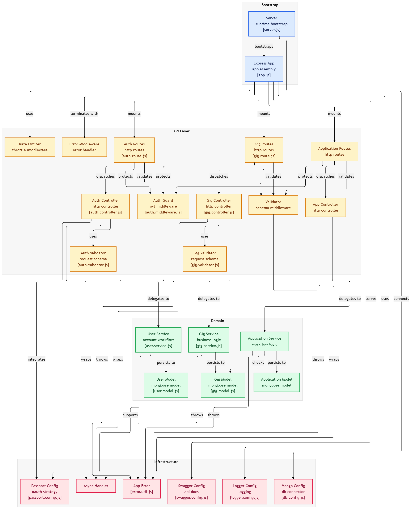

# Local Freelance Job Platform Backend


A production-ready backend API for a local freelance job marketplace that connects students with local businesses for short-term gigs and freelance opportunities.

The platform enables businesses to post gigs, students to apply, and businesses to review, accept, or reject applications through a structured workflow.

This backend follows scalable backend engineering principles using modular architecture, service-layer business logic, centralized error handling, middleware-driven validation, production security practices, and interactive Swagger API documentation.

---

# Live Deployment

- API Base URL: [Live API](https://local-freelance-backend.onrender.com)
- Swagger Documentation: [API Docs](https://local-freelance-backend.onrender.com/api-docs)

---

# Production Highlights

- Layered MVC + Service Architecture
- JWT Authentication + Refresh Tokens
- Google OAuth Authentication
- Role-Based Authorization
- Swagger/OpenAPI Documentation
- Zod Request Validation
- Centralized Error Handling
- Production Security Middleware
- Advanced Query Features
- Modular Scalable Architecture
- MongoDB Injection Protection
- Request Rate Limiting

---

# Features

- JWT Authentication & Authorization
- Google OAuth Login with Passport.js
- Refresh Token Authentication Flow
- Role-Based Authorization (Student / Business)
- Gig Creation & Management
- Student Application Workflow
- Duplicate Application Prevention
- Ownership-Based Authorization
- Automatic Rejection of Other Applicants on Acceptance
- Pagination, Filtering, Search & Sorting
- Swagger/OpenAPI Documentation
- Zod Request Validation
- Winston Logging
- Morgan Request Logging
- Rate Limiting
- MongoDB Injection Protection
- Helmet Security Middleware
- CORS Configuration
- Modular MVC + Service Architecture
- Production Deployment on Render

---

# Tech Stack

| Technology | Purpose |
|---|---|
| Node.js | Runtime environment |
| Express.js | Backend framework |
| MongoDB | NoSQL database |
| Mongoose | MongoDB ODM |
| JWT (jsonwebtoken) | Authentication |
| Passport.js | OAuth authentication |
| passport-google-oauth20 | Google OAuth strategy |
| bcryptjs | Password hashing |
| Zod | Request validation |
| Morgan | HTTP request logging |
| Winston | Structured application logging |
| express-rate-limit | Rate limiting |
| Helmet | Security headers |
| CORS | Cross-origin resource sharing |
| express-mongo-sanitize | MongoDB injection prevention |
| dotenv | Environment variable management |
| Nodemon | Development server |
| Swagger UI Express | Interactive API documentation |
| Swagger JSDoc | Swagger/OpenAPI generation |
| ES Modules | Modern JavaScript module system |

---

# System Architecture

The project follows a layered backend architecture with clear separation of concerns between routing, controllers, services, models, middleware, and infrastructure components.

## Architecture Layers

- **Routes** → API endpoint definitions
- **Controllers** → Request/response handling
- **Services** → Business logic
- **Models** → MongoDB schemas
- **Middlewares** → Authentication, authorization, validation, security
- **Validators** → Zod validation schemas
- **Config** → Database, Swagger, Passport, and Logger configuration
- **Utils** → Reusable helpers and custom error handling

---

## Architecture Diagram



---

# Folder Structure

```bash
.
├── src/
│   ├── config/
│   │   ├── db.config.js
│   │   ├── logger.config.js
│   │   ├── passport.config.js
│   │   └── swagger.config.js
│   │
│   ├── controllers/
│   │   ├── auth.controller.js
│   │   ├── gig.controller.js
│   │   └── application.controller.js
│   │
│   ├── middlewares/
│   │   ├── auth.middleware.js
│   │   ├── error.middleware.js
│   │   ├── rateLimiter.middleware.js
│   │   └── validator.middleware.js
│   │
│   ├── models/
│   │   ├── user.model.js
│   │   ├── gig.model.js
│   │   └── application.model.js
│   │
│   ├── routes/
│   │   ├── auth.route.js
│   │   ├── gig.route.js
│   │   └── application.route.js
│   │
│   ├── services/
│   │   ├── user.service.js
│   │   ├── gig.service.js
│   │   └── application.service.js
│   │
│   ├── utils/
│   │   ├── appError.util.js
│   │   └── asyncHandler.util.js
│   │
│   └── validators/
│       ├── auth.validator.js
│       ├── gig.validator.js
│       └── application.validator.js
│
├── docs/
├── logs/
├── .env
├── .gitignore
├── app.js
├── server.js
├── package.json
├── LICENSE
└── README.md
```

---

# Getting Started

## Prerequisites

- Node.js v18+ (recommended: v22)
- MongoDB Atlas or local MongoDB instance
- npm or yarn

---

## Clone Repository

```bash
git clone https://github.com/rahulreddy006/local-freelance-job-board-backend.git
```

```bash
cd local-freelance-job-board-backend
```

---

## Install Dependencies

```bash
npm install
```

---

## Configure Environment Variables

Create a `.env` file in the project root.

Example:

```env
PORT=4000

MONGO_URI=mongodb+srv://your-mongodb-uri

JWT_SECRET=your_access_secret
JWT_REFRESH_SECRET=your_refresh_secret

JWT_EXPIRES_IN=15m
JWT_REFRESH_EXPIRES_IN=7d

GOOGLE_CLIENT_ID=your_google_client_id
GOOGLE_CLIENT_SECRET=your_google_client_secret

GOOGLE_CALLBACK_URL=http://localhost:4000/api/v1/auth/google/callback

API_URL=http://localhost:4000/api/v1
```

---

## Start Development Server

```bash
npm run dev
```

---

## Start Production Server

```bash
npm start
```

---

## Local Server URL

```bash
http://localhost:4000
```

---

# Environment Variables

| Variable | Purpose | Required |
|---|---|---|
| PORT | Application server port | Yes |
| MONGO_URI | MongoDB connection string | Yes |
| JWT_SECRET | JWT access token secret | Yes |
| JWT_REFRESH_SECRET | JWT refresh token secret | Yes |
| JWT_EXPIRES_IN | Access token expiration | Yes |
| JWT_REFRESH_EXPIRES_IN | Refresh token expiration | Yes |
| GOOGLE_CLIENT_ID | Google OAuth client ID | Yes |
| GOOGLE_CLIENT_SECRET | Google OAuth client secret | Yes |
| GOOGLE_CALLBACK_URL | OAuth callback URL | Yes |
| API_URL | Base API URL for Swagger | Yes |

---

# API Status

| Service | Status |
|---|---|
| Backend API | Online |
| MongoDB Database | Connected |
| Swagger Documentation | Available |

---

# API Endpoints Overview

## Authentication Routes

| Method | Endpoint | Description | Auth Required |
|---|---|---|---|
| POST | `/api/v1/auth/register` | Register a new user | No |
| POST | `/api/v1/auth/login` | Login user and generate tokens | No |
| POST | `/api/v1/auth/refresh-token` | Generate new access token | No |
| PATCH | `/api/v1/auth/complete-profile` | Complete Google OAuth onboarding | Yes |
| GET | `/api/v1/auth/google` | Initiate Google OAuth login | No |
| GET | `/api/v1/auth/google/callback` | Google OAuth callback route | No |

---

## Gig Routes

| Method | Endpoint | Description | Auth Required |
|---|---|---|---|
| GET | `/api/v1/gigs` | Get all gigs with filtering/search | No |
| POST | `/api/v1/gigs` | Create a new gig | Yes (Business) |
| GET | `/api/v1/gigs/:gigId` | Get gig details by ID | No |
| GET | `/api/v1/gigs/my-gigs` | Get all gigs created by logged-in business | Yes (Business) |

---

## Application Routes

| Method | Endpoint | Description | Auth Required |
|---|---|---|---|
| POST | `/api/v1/gigs/:gigId/apply` | Apply for a gig | Yes (Student) |
| PATCH | `/api/v1/applications/:applicationId/status` | Accept/reject application | Yes (Business Owner) |
| GET | `/api/v1/applications/my-applications` | Get all student applications | Yes (Student) |
| GET | `/api/v1/gigs/:gigId/applications` | Get applications for a specific gig | Yes (Business Owner) |

---

# Authentication

The project uses JWT-based authentication with refresh token support and Google OAuth onboarding.

## Local Authentication Flow

1. User registers using email and password
2. Password is hashed using bcrypt
3. User logs in
4. Access token and refresh token are generated
5. Client sends access token using Authorization header

---

## Google OAuth Flow

1. User clicks "Login with Google"
2. Backend redirects user to Google OAuth consent screen
3. Google returns callback with user profile
4. Backend creates or links account
5. JWT tokens are generated
6. User completes onboarding role selection

---

## Authorization Header

```http
Authorization: Bearer <access_token>
```

---

## Supported Roles

- `student`
- `business`

---

# Database Models

## User Model

| Field | Type |
|---|---|
| name | String |
| email | String |
| password | String |
| provider | Enum (`local`, `google`) |
| googleId | String |
| role | Enum (`student`, `business`) |
| isOnboarded | Boolean |

---

## Gig Model

| Field | Type |
|---|---|
| title | String |
| description | String |
| price | Number |
| skillsRequired | Array<String> |
| deadline | Date |
| status | Enum |
| ownerId | ObjectId → User |

---

## Application Model

| Field | Type |
|---|---|
| gigId | ObjectId → Gig |
| appliedBy | ObjectId → User |
| proposal | String |
| status | Enum (`pending`, `accepted`, `rejected`) |

The application model uses a compound unique index to prevent duplicate applications.

---

# Query Features

## Pagination

```bash
/api/v1/gigs?page=1&limit=10
```

---

## Search

```bash
/api/v1/gigs?search=frontend
```

---

## Filtering

```bash
/api/v1/gigs?skill=nodejs
```

---

## Sorting

```bash
/api/v1/gigs?sort=price_desc
```

Supported sorting:

- `newest`
- `oldest`
- `price_asc`
- `price_desc`

---

# Security Features

- Password hashing using bcrypt
- JWT authentication
- Refresh token authentication
- Helmet security middleware
- MongoDB injection sanitization
- Request rate limiting
- Protected routes
- Ownership-based authorization
- Input validation with Zod
- CORS protection

---

# Logging

The project uses:

- **Morgan** → HTTP request logging
- **Winston** → Structured application logging

Logs are separated for:

- Incoming requests
- Errors
- Production monitoring

---

# Swagger API Documentation

Interactive Swagger documentation is available at:

```bash
https://local-freelance-backend.onrender.com/api-docs
```

Swagger includes:

- Request bodies
- Response schemas
- Authentication testing
- Query parameters
- Route descriptions

---

# API Testing

## Postman Collection

You can test all API endpoints using the Postman collection below:

[Postman Collection](YOUR_POSTMAN_COLLECTION_LINK)

---

# Business Workflow

```text
Business creates gig
        ↓
Students apply
        ↓
Businesses review applications
        ↓
Business accepts one application
        ↓
Other pending applications are automatically rejected
        ↓
Gig status changes to "in-progress"
```

---

# Technical Decisions

## Why Express.js?

Express.js provides lightweight and flexible backend architecture while allowing full control over middleware, routing, and request lifecycle management.

It was selected because:

- Lightweight and production-proven
- Excellent middleware ecosystem
- Easy integration with MongoDB and Passport.js
- Suitable for scalable REST API architecture

---

## Why MongoDB + Mongoose?

MongoDB was selected because gig listings and applications are naturally document-oriented and evolve frequently.

Mongoose was used to:

- Enforce schema validation
- Simplify querying
- Manage model relationships
- Support middleware/hooks and indexing

---

## Why Service Layer Architecture?

Business logic was separated into services to avoid fat controllers and improve maintainability.

Benefits include:

- Better separation of concerns
- Easier testing
- Cleaner controllers
- Scalable project structure
- Easier future migration to microservices

---

## Why JWT + Refresh Tokens?

JWT access tokens provide stateless authentication.

Refresh tokens were added to improve security and user experience by:

- Reducing repeated logins
- Allowing short-lived access tokens
- Supporting token rotation strategies in future upgrades

---

## Why Zod Validation?

Zod provides runtime request validation with clean schema definitions and better developer experience compared to manual validation.

It helps ensure:

- Consistent API request validation
- Cleaner error handling
- Safer controller logic

---

## Why Swagger Documentation?

Swagger/OpenAPI was integrated to provide interactive API testing and improve developer onboarding.

Benefits include:

- Faster frontend-backend integration
- Self-documenting APIs
- Easier debugging and testing
- Better collaboration

---

# Scripts

| Script | Description |
|---|---|
| `npm run dev` | Start development server using nodemon |
| `npm start` | Start production server |

---

# Future Improvements

- Redis caching
- Docker containerization
- CI/CD pipelines
- File uploads with Cloudinary
- Email verification
- Forgot/reset password flow
- Real-time notifications
- WebSocket chat system
- Payment integration
- Automated testing with Jest & Supertest

---

# Contributing

Contributions are welcome.

## Steps

1. Fork the repository

2. Create a feature branch

```bash
git checkout -b feature/your-feature-name
```

3. Commit your changes

```bash
git commit -m "feat: add your feature"
```

4. Push to your branch

```bash
git push origin feature/your-feature-name
```

5. Open a Pull Request

---

# License

This project is licensed under the MIT License.

See the [LICENSE](LICENSE) file for more information.
